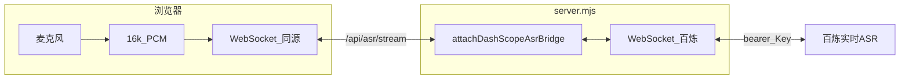

# 语音输入（百炼 Paraformer 实时识别）

本文说明本项目中**语音输入**的实现方式、环境变量、数据流与常见问题。语音能力**不**使用浏览器 Web Speech API，而是由服务端将麦克风 PCM 音频转发至阿里云**大模型服务平台百炼**的**实时语音识别**接口（默认 **Paraformer** 模型）。

## 功能与约束

| 项目 | 说明 |
|------|------|
| 鉴权 | 与对话接口共用 **`DASHSCOPE_API_KEY`**（百炼 API Key） |
| 模型 | 默认 **`paraformer-realtime-v2`**，可通过 `DASHSCOPE_ASR_MODEL` 覆盖 |
| 上行协议 | 浏览器 → 本站 **`WebSocket`** 路径 **`/api/asr/stream`**（同源 `ws:` / `wss:`） |
| 下行协议 | 本站 → 百炼 **`wss://…/api-ws/v1/inference/`**，遵循官方 **run-task / 二进制 PCM / finish-task** 协议（与 [Fun-ASR WebSocket API](https://help.aliyun.com/zh/model-studio/fun-asr-realtime-websocket-api) 一致，仅 **`model`** 换为 Paraformer） |
| 音频格式 | **16 kHz**、单声道、**16-bit PCM**（小端）；由前端从麦克风重采样后分帧发送 |

## 数据流（简图）



- 浏览器**从不**接触百炼 API Key；仅与本站建立 WebSocket。
- 用户结束说话时**关闭** WebSocket，服务端在 `close` 时向百炼发送 **`finish-task`**（若任务已启动）。

## 环境变量

| 变量 | 含义 | 默认（中国内地） |
|------|------|------------------|
| `DASHSCOPE_API_KEY` | 百炼 API Key（必填，与 Chat 共用） | 无 |
| `DASHSCOPE_ASR_WSS` | 实时语音识别 WebSocket 根 URL | `wss://dashscope.aliyuncs.com/api-ws/v1/inference/` |
| `DASHSCOPE_ASR_MODEL` | 实时 ASR 模型名 | `paraformer-realtime-v2` |

**国际 / 新加坡**等地域：请将 `DASHSCOPE_ASR_WSS` 换为文档中的 **`wss://dashscope-intl.aliyuncs.com/api-ws/v1/inference/`**，并确保 API Key 与控制台地域一致。

详见根目录 **`.env.example`** 与 **`README.md`** 环境变量表。

## 服务端要点（`server.mjs`）

- 使用 **`ws`** 库：`HTTP` 服务器的 **`upgrade`** 事件仅对路径 **`/api/asr/stream`** 升级为 WebSocket，回调 **`attachDashScopeAsrBridge`**。
- 对每个浏览器连接：再建立一条到 **`DASHSCOPE_ASR_WSS`** 的 WebSocket，请求头 **`Authorization: bearer <DASHSCOPE_API_KEY>`**。
- 向百炼发送 **`run-task`**（`payload.model` = `DASHSCOPE_ASR_MODEL`，`parameters.format` = `pcm`，`sample_rate` = `16000`）。
- 收到 **`task-started`** 后，将浏览器发来的**二进制帧**原样转发给百炼。
- 解析 **`result-generated`** 中的 `payload.output.sentence`，向浏览器推送 JSON：`{ type: "result", text, sentenceEnd }`。
- 任务结束：**`task-finished`** 或连接异常时，向浏览器推送 **`{ type: "done" }`** 或 **`{ type: "error", message }`** 并关闭连接。

日志前缀：**`[api/asr]`**（DashScope 或浏览器 WebSocket 错误时）。

## 前端要点（`public/app.js`）

- 点击「语音输入」→ 建立 **`WebSocket(asrWebSocketUrl())`**。
- 收到 **`{ type: "ready" }`** 后调用 **`getUserMedia`**，用 **`AudioContext` + `ScriptProcessorNode`** 将采样率转换为 **16 kHz**，以 **`Int16Array`** 缓冲区通过 WebSocket **发送二进制**。
- 再次点击或关闭连接即停止采集；**关闭 WebSocket** 触发服务端 **`finish-task`**。
- 识别过程中 **`isRecognizing`** 为真，会禁用「生成真心话」按钮，避免与流式对话并发。

## 部署与 Nginx

语音需要 **WebSocket** 穿透反代，且公网页面需 **HTTPS** 以便麦克风权限与 **`wss://`**。

在 **`location /`**（或对应站点）中除现有 `proxy_pass` 外，需保证：

```nginx
proxy_http_version 1.1;
proxy_set_header Upgrade $http_upgrade;
proxy_set_header Connection "upgrade";
proxy_read_timeout 3600s;
```

（具体 `location` 是否与 `/api/asr` 拆分，按你现有 Nginx 结构合并即可。）

更完整的 ECS / systemd 说明见 **`docs/deploy-troubleshooting.md`**（含语音与 WebSocket 小节）。

## 常见问题

| 现象 | 可能原因 | 处理 |
|------|----------|------|
| 语音按钮报错「服务器未配置 DASHSCOPE_API_KEY」 | 服务端未加载 Key | 配置 `.env` 或环境变量后重启进程 |
| 连接立即失败 | `ws` 依赖未安装、或端口/反代未放行 WebSocket | `npm install`；检查 Nginx `Upgrade` 头 |
| 无识别结果 | 麦克风未授权、采样错误、模型与地域不匹配 | 浏览器允许麦克风；核对 `DASHSCOPE_ASR_WSS` 与 Key 地域 |
| 仅本地可用、公网不可用 | 未使用 HTTPS | 为站点配置 TLS，使用 **`wss://`** 访问 |

## 相关文件

| 文件 | 作用 |
|------|------|
| `server.mjs` | `attachDashScopeAsrBridge`、`upgrade` 挂载 |
| `public/app.js` | 麦克风采集、PCM 上行、结果写入输入框 |
| `public/index.html` | 「语音输入」按钮 |
| `public/styles.css` | `.mic-btn.is-listening` 状态样式 |

## 相关文档

- 本地运行与变量总表：根目录 **`README.md`**
- 后端调试（含 ASR 日志）：**`docs/backend-debug.md`**
- 服务器与 Nginx：**`docs/deploy-troubleshooting.md`**
